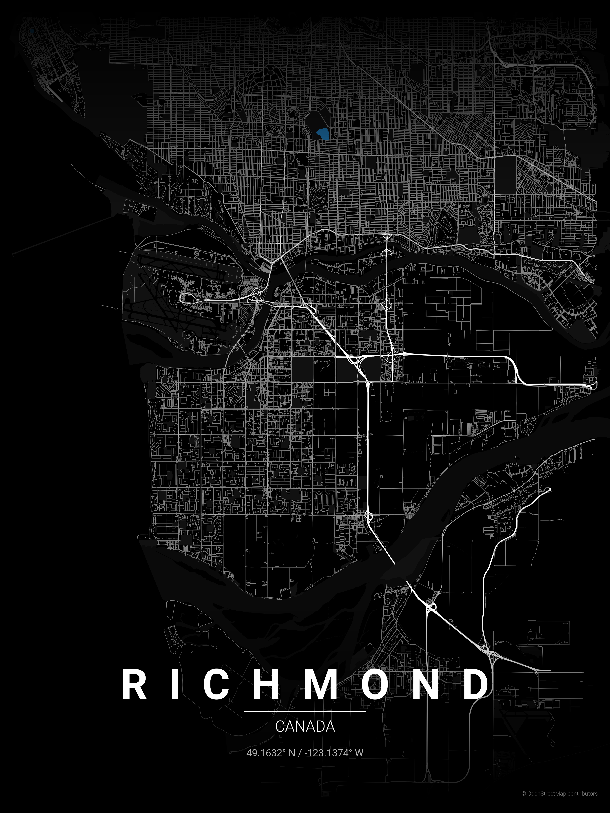

# City Map Poster Generator

Generate beautiful, minimalist map posters for any city in the world.


## Examples


| Country      | City           | Theme           | Poster |
|:------------:|:--------------:|:---------------:|:------:|
| Canada       | Toronto        | noir            |  |
| Canada       | Vancouver      | ocean           |  |
| Canada       | Richmond       | noir            |  |
| Netherlands  | Amsterdam      | ocean           |  |

## Installation

```bash
pip install -r requirements.txt
```

## Usage

```bash
python create_map_poster.py --city <city> --country <country> [options]
```

### Options

| Option | Short | Description | Default |
|--------|-------|-------------|---------|
| `--city` | `-c` | City name | required |
| `--country` | `-C` | Country name | required |
| `--theme` | `-t` | Theme name | feature_based |
| `--distance` | `-d` | Map radius in meters | 29000 |
| `--list-themes` | | List all available themes | |

### Examples

```bash
# Canadian cities
python create_map_poster.py -c "Toronto" -C "Canada" -t noir -d 18000         # Toronto urban grid
python create_map_poster.py -c "Vancouver" -C "Canada" -t ocean -d 14000      # Pacific waterfront
python create_map_poster.py -c "Richmond" -C "Canada" -t noir -d 12000        # Suburban grid
python create_map_poster.py -c "Toronto" -C "Canada" -t blueprint -d 12000    # Downtown peninsula
python create_map_poster.py -c "Vancouver" -C "Canada" -t blueprint -d 12000  # Urban peninsula

# European cities
python create_map_poster.py -c "Amsterdam" -C "Netherlands" -t ocean -d 6000  # Concentric canals

# List available themes
python create_map_poster.py --list-themes
```

### Distance Guide

| Distance | Best for |
|----------|----------|
| 4000-6000m | Small/dense cities (Venice, Amsterdam center) |
| 8000-12000m | Medium cities, focused downtown (Paris, Barcelona) |
| 15000-20000m | Large metros, full city view (Tokyo, Mumbai) |

## Themes

17 themes available in `themes/` directory:

| Theme | Style |
|-------|-------|
| `feature_based` | Classic black & white with road hierarchy |
| `gradient_roads` | Smooth gradient shading |
| `contrast_zones` | High contrast urban density |
| `noir` | Pure black background, white roads |
| `midnight_blue` | Navy background with gold roads |
| `blueprint` | Architectural blueprint aesthetic |
| `neon_cyberpunk` | Dark with electric pink/cyan |
| `warm_beige` | Vintage sepia tones |
| `pastel_dream` | Soft muted pastels |
| `japanese_ink` | Minimalist ink wash style |
| `forest` | Deep greens and sage |
| `ocean` | Blues and teals for coastal cities |
| `terracotta` | Mediterranean warmth |
| `sunset` | Warm oranges and pinks |
| `autumn` | Seasonal burnt oranges and reds |
| `copper_patina` | Oxidized copper aesthetic |
| `monochrome_blue` | Single blue color family |

## Output

Posters are saved to `posters/` directory with format:
```
{city}_{theme}_{YYYYMMDD_HHMMSS}.png
```

## Adding Custom Themes

Create a JSON file in `themes/` directory:

```json
{
  "name": "My Theme",
  "description": "Description of the theme",
  "bg": "#FFFFFF",
  "text": "#000000",
  "gradient_color": "#FFFFFF",
  "water": "#C0C0C0",
  "parks": "#F0F0F0",
  "road_motorway": "#0A0A0A",
  "road_primary": "#1A1A1A",
  "road_secondary": "#2A2A2A",
  "road_tertiary": "#3A3A3A",
  "road_residential": "#4A4A4A",
  "road_default": "#3A3A3A"
}
```

## Project Structure

```
map_poster/
├── create_map_poster.py          # Main script
├── themes/               # Theme JSON files
├── fonts/                # Roboto font files
├── posters/              # Generated posters
└── README.md
```

## Hacker's Guide

Quick reference for contributors who want to extend or modify the script.

### Architecture Overview

```
┌─────────────────┐     ┌──────────────┐     ┌─────────────────┐
│   CLI Parser    │────▶│  Geocoding   │────▶│  Data Fetching  │
│   (argparse)    │     │  (Nominatim) │     │    (OSMnx)      │
└─────────────────┘     └──────────────┘     └─────────────────┘
                                                     │
                        ┌──────────────┐             ▼
                        │    Output    │◀────┌─────────────────┐
                        │  (matplotlib)│     │   Rendering     │
                        └──────────────┘     │  (matplotlib)   │
                                             └─────────────────┘
```

### Key Functions

| Function | Purpose | Modify when... |
|----------|---------|----------------|
| `get_coordinates()` | City → lat/lon via Nominatim | Switching geocoding provider |
| `create_poster()` | Main rendering pipeline | Adding new map layers |
| `get_edge_colors_by_type()` | Road color by OSM highway tag | Changing road styling |
| `get_edge_widths_by_type()` | Road width by importance | Adjusting line weights |
| `create_gradient_fade()` | Top/bottom fade effect | Modifying gradient overlay |
| `load_theme()` | JSON theme → dict | Adding new theme properties |

### Rendering Layers (z-order)

```
z=11  Text labels (city, country, coords)
z=10  Gradient fades (top & bottom)
z=3   Roads (via ox.plot_graph)
z=2   Parks (green polygons)
z=1   Water (blue polygons)
z=0   Background color
```

### OSM Highway Types → Road Hierarchy

```python
# In get_edge_colors_by_type() and get_edge_widths_by_type()
motorway, motorway_link     → Thickest (1.2), darkest
trunk, primary              → Thick (1.0)
secondary                   → Medium (0.8)
tertiary                    → Thin (0.6)
residential, living_street  → Thinnest (0.4), lightest
```

### Adding New Features

**New map layer (e.g., railways):**
```python
# In create_poster(), after parks fetch:
try:
    railways = ox.features_from_point(point, tags={'railway': 'rail'}, dist=dist)
except:
    railways = None

# Then plot before roads:
if railways is not None and not railways.empty:
    railways.plot(ax=ax, color=THEME['railway'], linewidth=0.5, zorder=2.5)
```

**New theme property:**
1. Add to theme JSON: `"railway": "#FF0000"`
2. Use in code: `THEME['railway']`
3. Add fallback in `load_theme()` default dict

### Typography Positioning

All text uses `transform=ax.transAxes` (0-1 normalized coordinates):
```
y=0.14  City name (spaced letters)
y=0.125 Decorative line
y=0.10  Country name
y=0.07  Coordinates
y=0.02  Attribution (bottom-right)
```

### Useful OSMnx Patterns

```python
# Get all buildings
buildings = ox.features_from_point(point, tags={'building': True}, dist=dist)

# Get specific amenities
cafes = ox.features_from_point(point, tags={'amenity': 'cafe'}, dist=dist)

# Different network types
G = ox.graph_from_point(point, dist=dist, network_type='drive')  # roads only
G = ox.graph_from_point(point, dist=dist, network_type='bike')   # bike paths
G = ox.graph_from_point(point, dist=dist, network_type='walk')   # pedestrian
```

### Performance Tips

- Large `dist` values (>20km) = slow downloads + memory heavy
- Cache coordinates locally to avoid Nominatim rate limits
- Use `network_type='drive'` instead of `'all'` for faster renders
- Reduce `dpi` from 300 to 150 for quick previews
